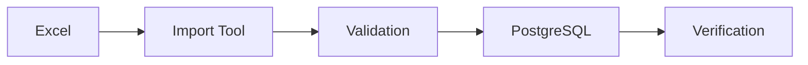

# Arquitectura Técnica - Sistema BAMBU 2025
## 🔥 VERSIÓN REAL - Enero 2025

## 1. VISIÓN ARQUITECTÓNICA

### 1.1 Principios de Diseño REALES
- **API-First**: Laravel API puro + Vue SPA 100% separado
- **SOLID Principles**: Código mantenible y extensible
- **Domain-Driven**: Separación por dominios (Catalog, Sales, Logistics)
- **TDD desde día 1**: Tests antes que features
- **Pragmatic Architecture**: Soluciones efectivas, no over-engineering

### 1.2 Atributos de Calidad ADAPTADOS
- **Mantenibilidad**: Prioridad #1 - código limpio y documentado
- **Performance**: < 300ms (realista para equipo pequeño)
- **Desarrollo**: Velocidad y simplicidad
- **Testing**: Cobertura >70% (alcanzable)
- **Deploy**: Manual, confiable

## 2. STACK TECNOLÓGICO REAL

### 2.1 Backend DEFINITIVO
```yaml
Core:
  - PHP: 8.3.16 (Laragon)
  - Laravel: 11.x (12.21.0 actual)
  - Base de datos: PostgreSQL 15+ (decisión arquitectónica correcta)
  
API:
  - REST: Laravel Sanctum (NO GraphQL)
  - Authentication: Sanctum tokens
  - NO WebSockets (por ahora)
  
Cache y Queue:
  - File cache (desarrollo)
  - Database queues (simple)
  - NO Redis (no necesario inicial)
  
Testing:
  - PHPUnit: Unit tests
  - Pest: Feature tests (opcional)
  - NO E2E complejos inicialmente
```

### 2.2 Frontend DEFINITIVO
```yaml
Framework:
  - Vue.js: 3.5.18 (SPA puro, NO SSR)
  - TypeScript: 5.9.2
  - Pinia: 3.0.3 (state management)
  
UI/UX:
  - Tailwind CSS: 4.0+ (ya configurado)
  - NO Headless UI (componentes propios)
  - NO iconos externos (SVG inline)
  
Build:
  - Vite: 7.0.4 (configurado para Windows)
  - NO ESLint/Prettier (inicialmente)
```

### 2.3 Infraestructura REAL
```yaml
Desarrollo:
  - Laragon (Windows local)
  - NO Docker (decisión confirmada)
  - NO CI/CD inicial

Producción:
  - VPS manual
  - Deploy manual (FTP/rsync)
  - NO CDN/Cloud servicios
  - Logs Laravel nativos (NO Sentry)
```

## 3. ARQUITECTURA DE CAPAS

```
┌─────────────────────────────────────────────────┐
│                   FRONTEND                       │
│         Vue.js SPA + TypeScript + Pinia         │
└─────────────────────────────────────────────────┘
                         │
                    API Gateway
                         │
┌─────────────────────────────────────────────────┐
│                  APPLICATION                     │
│              Laravel REST API                    │
├─────────────────────────────────────────────────┤
│                   DOMAIN                         │
│          Business Logic + Entities               │
├─────────────────────────────────────────────────┤
│               INFRASTRUCTURE                     │
│     Repositories + External Services             │
└─────────────────────────────────────────────────┘
                         │
┌─────────────────────────────────────────────────┐
│                  DATABASE                        │
│              PostgreSQL + Redis                  │
└─────────────────────────────────────────────────┘
```

## 4. ESTRUCTURA DE CARPETAS

### 4.1 Backend (Laravel)
```
bambu-backend/
├── app/
│   ├── Domain/                 # Lógica de negocio
│   │   ├── Catalog/
│   │   │   ├── Models/
│   │   │   ├── Services/
│   │   │   ├── Repositories/
│   │   │   └── Events/
│   │   ├── Sales/
│   │   │   ├── Models/
│   │   │   ├── Services/
│   │   │   └── ValueObjects/
│   │   ├── Logistics/
│   │   └── Shared/
│   ├── Application/           # Casos de uso
│   │   ├── Commands/
│   │   ├── Queries/
│   │   └── DTOs/
│   ├── Infrastructure/        # Implementaciones
│   │   ├── Persistence/
│   │   ├── External/
│   │   └── Cache/
│   └── Http/                  # Capa de presentación
│       ├── Controllers/
│       ├── Middleware/
│       ├── Requests/
│       └── Resources/
├── database/
│   ├── migrations/
│   ├── factories/
│   └── seeders/
├── tests/
│   ├── Unit/
│   ├── Feature/
│   └── Integration/
└── docker/
    └── Dockerfile
```

### 4.2 Frontend (Vue.js)
```
bambu-frontend/
├── src/
│   ├── modules/              # Módulos por dominio
│   │   ├── catalog/
│   │   │   ├── components/
│   │   │   ├── composables/
│   │   │   ├── stores/
│   │   │   ├── views/
│   │   │   └── routes.ts
│   │   ├── sales/
│   │   ├── logistics/
│   │   └── shared/
│   ├── core/                # Funcionalidad core
│   │   ├── api/
│   │   ├── auth/
│   │   ├── config/
│   │   └── utils/
│   ├── design/              # Sistema de diseño
│   │   ├── components/
│   │   ├── layouts/
│   │   └── tokens/
│   └── assets/
├── tests/
│   ├── unit/
│   └── e2e/
└── docker/
    └── Dockerfile
```

## 5. DISEÑO DE BASE DE DATOS

### 5.1 Esquema Principal
```sql
-- Dominios identificados
CREATE SCHEMA catalog;
CREATE SCHEMA sales;
CREATE SCHEMA logistics;
CREATE SCHEMA auth;

-- Tablas del dominio Catalog
CREATE TABLE catalog.products (
    id UUID PRIMARY KEY DEFAULT gen_random_uuid(),
    sku VARCHAR(50) UNIQUE NOT NULL,
    name VARCHAR(200) NOT NULL,
    description TEXT,
    base_price DECIMAL(10,2) NOT NULL,
    current_stock INTEGER NOT NULL DEFAULT 0,
    min_stock INTEGER NOT NULL DEFAULT 0,
    weight_kg DECIMAL(8,3),
    is_combo BOOLEAN DEFAULT FALSE,
    brand VARCHAR(50) DEFAULT 'BAMBU',
    category_id UUID REFERENCES catalog.categories(id),
    status VARCHAR(20) DEFAULT 'active',
    metadata JSONB,
    created_at TIMESTAMP NOT NULL DEFAULT NOW(),
    updated_at TIMESTAMP NOT NULL DEFAULT NOW(),
    deleted_at TIMESTAMP
);

-- Índices para performance
CREATE INDEX idx_products_sku ON catalog.products(sku);
CREATE INDEX idx_products_name ON catalog.products USING gin(name gin_trgm_ops);
CREATE INDEX idx_products_status ON catalog.products(status) WHERE deleted_at IS NULL;
```

### 5.2 Particionamiento
```sql
-- Particionamiento de tablas grandes por fecha
CREATE TABLE sales.orders (
    id UUID NOT NULL,
    order_date DATE NOT NULL,
    -- otros campos
) PARTITION BY RANGE (order_date);

-- Particiones mensuales automáticas
CREATE TABLE sales.orders_2025_01 PARTITION OF sales.orders
    FOR VALUES FROM ('2025-01-01') TO ('2025-02-01');
```

## 6. PATRONES DE DISEÑO

### 6.1 Repository Pattern
```php
// Domain/Catalog/Repositories/ProductRepository.php
interface ProductRepository
{
    public function find(ProductId $id): ?Product;
    public function findBySku(string $sku): ?Product;
    public function save(Product $product): void;
    public function search(ProductSearchCriteria $criteria): ProductCollection;
}

// Infrastructure/Persistence/EloquentProductRepository.php
class EloquentProductRepository implements ProductRepository
{
    public function find(ProductId $id): ?Product
    {
        $model = ProductModel::find($id->value());
        return $model ? Product::fromPrimitives($model->toArray()) : null;
    }
}
```

### 6.2 Command/Query Separation (CQRS)
```php
// Application/Commands/CreateQuotationCommand.php
final class CreateQuotationCommand
{
    public function __construct(
        public readonly string $customerId,
        public readonly array $items,
        public readonly ?string $notes = null
    ) {}
}

// Application/Commands/CreateQuotationHandler.php
final class CreateQuotationHandler
{
    public function handle(CreateQuotationCommand $command): QuotationId
    {
        // Lógica de negocio
    }
}
```

### 6.3 Event Sourcing (Parcial)
```php
// Domain/Sales/Events/OrderConfirmed.php
final class OrderConfirmed extends DomainEvent
{
    public function __construct(
        public readonly OrderId $orderId,
        public readonly CustomerId $customerId,
        public readonly Money $totalAmount,
        public readonly DateTimeImmutable $occurredOn
    ) {}
}
```

## 7. SEGURIDAD

### 7.1 Autenticación y Autorización
```yaml
Autenticación:
  - JWT con refresh tokens
  - 2FA opcional con TOTP
  - Session timeout configurable

Autorización:
  - RBAC (Role-Based Access Control)
  - Políticas por recurso
  - Middleware de validación
```

### 7.2 Seguridad de API
```php
// Middleware stack
Route::middleware([
    'throttle:api',           // Rate limiting
    'auth:sanctum',          // Autenticación
    'verified',              // Email verificado
    'ability:read-products', // Permisos
    'log.requests',          // Auditoría
])->group(function () {
    // Rutas protegidas
});
```

### 7.3 Protección de Datos
- Encriptación en tránsito (TLS 1.3)
- Encriptación en reposo (AES-256)
- Hashing de passwords (Argon2id)
- Sanitización de inputs
- SQL injection prevention
- XSS protection

## 8. INTEGRACIÓN Y DESPLIEGUE

### 8.1 CI/CD Pipeline
```yaml
# .github/workflows/deploy.yml
name: Deploy
on:
  push:
    branches: [main]

jobs:
  test:
    runs-on: ubuntu-latest
    steps:
      - uses: actions/checkout@v4
      - name: Run tests
        run: |
          composer test
          npm test

  deploy:
    needs: test
    runs-on: ubuntu-latest
    steps:
      - name: Deploy to production
        run: |
          ssh deploy@server 'cd /app && git pull && composer install --no-dev'
          ssh deploy@server 'cd /app && php artisan migrate --force'
          ssh deploy@server 'cd /app && php artisan config:cache'
```

### 8.2 Monitoreo
```yaml
Métricas:
  - APM: New Relic
  - Logs: ELK Stack
  - Uptime: Pingdom
  - Errors: Sentry

Alertas:
  - Response time > 1s
  - Error rate > 1%
  - CPU > 80%
  - Disk > 90%
```

## 9. ESCALABILIDAD

### 9.1 Horizontal Scaling
```nginx
# Load Balancer Configuration
upstream backend {
    least_conn;
    server backend1.bambu.local:8000 weight=1;
    server backend2.bambu.local:8000 weight=1;
    server backend3.bambu.local:8000 weight=1;
}
```

### 9.2 Caching Strategy
```php
// Multi-level caching
class ProductService
{
    public function find(string $sku): Product
    {
        // L1: Local cache (APCu)
        if ($cached = apcu_fetch("product:$sku")) {
            return $cached;
        }
        
        // L2: Redis cache
        if ($cached = Redis::get("product:$sku")) {
            apcu_store("product:$sku", $cached, 300);
            return $cached;
        }
        
        // L3: Database
        $product = $this->repository->findBySku($sku);
        
        // Cache warming
        Redis::setex("product:$sku", 3600, $product);
        apcu_store("product:$sku", $product, 300);
        
        return $product;
    }
}
```

## 10. PLAN DE MIGRACIÓN

### 10.1 Estrategia
1. **Strangler Fig Pattern**: Reemplazo gradual
2. **Feature Flags**: Activación controlada
3. **Blue-Green Deployment**: Sin downtime
4. **Data Migration**: ETL con validación

### 10.2 Fases


## 11. DOCUMENTACIÓN TÉCNICA

### 11.1 API Documentation
- OpenAPI 3.0 Specification
- Postman Collections
- API Versioning (v1, v2)

### 11.2 Code Documentation
- PHPDoc para backend
- JSDoc para frontend
- README por módulo
- ADR (Architecture Decision Records)

## 12. ANEXOS

### 12.1 Decisiones de Arquitectura
| ADR | Decisión | Razón |
|-----|----------|-------|
| 001 | PostgreSQL vs MySQL | JSONB, partitioning, performance |
| 002 | Vue vs React | Curva de aprendizaje, ecosistema |
| 003 | Monolito modular vs Microservicios | Complejidad, equipo pequeño |

### 12.2 Dependencias Críticas
- Laravel Framework
- Vue.js Framework
- PostgreSQL Database
- Redis Cache
- Docker Platform

---

**Documento creado**: Enero 2025  
**Versión**: 1.0  
**Arquitecto**: Sistema BAMBU Team  
**Próxima revisión**: Trimestral